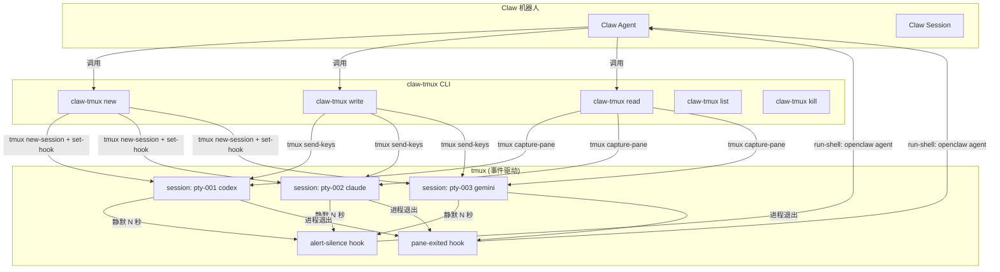
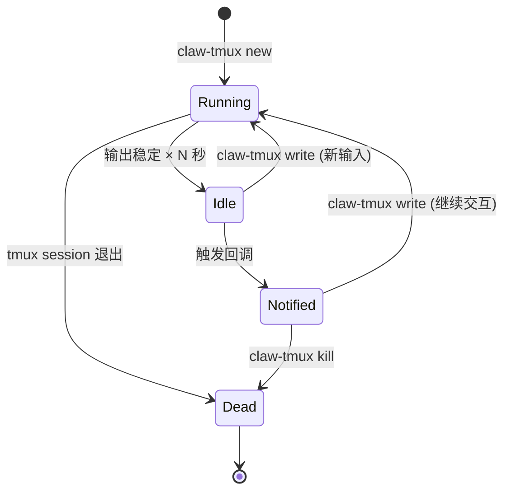
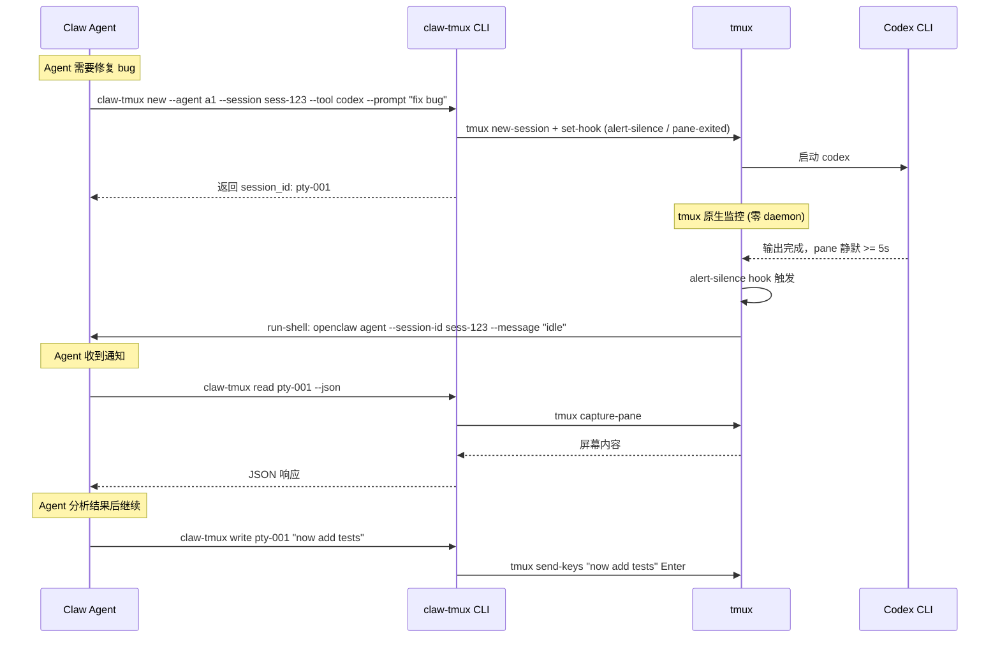

# Claw CLI AI Session Manager（`claw-tmux`）

为 claw 机器人设计的轻量级 CLI 工具，管理 CLI AI 工具（Codex、Claude Code 等）的终端会话。支持 tmux 式的 new/write/read，通过 tmux 原生 hooks 事件驱动检测完成并通知 claw agent。

**不依赖 agent-deck**，直接封装 tmux 命令。通过 `openclaw agent` CLI 将完成通知回传给 claw agent session。整个实现约 150-200 行 Bash。

> [!IMPORTANT]
> 最低要求 **tmux 3.2+**（`silence-action` 支持）。启动时通过 `tmux -V` 校验。

## 核心需求

1. **会话管理**：像 tmux 一样 new/write/read 终端会话
2. **完成检测**：tmux 原生 `monitor-silence` + hooks 事件驱动检测
3. **通知回调**：通过 `openclaw agent --session-id` 通知 claw 机器人

## 核心 tmux 命令映射

| claw-tmux 操作 | tmux 底层命令 |
|---|---|
| `new` | `tmux new-session -d -s $id -x 200 -y 50 "$tool_cmd"` |
| `write` | `tmux send-keys -t $id "prompt" Enter` |
| `read` | `tmux capture-pane -t $id -p [-S -10000]` |
| `attach` | `tmux attach-session -t $id` |
| `kill` | `tmux kill-session -t $id` |
| `list` | `tmux ls` + `~/.claw-tmux/state.json` |

## 通知方式：OpenClaw 集成

tmux hooks 触发时调用 **独立的 notify.sh 脚本**（避免 hook 内引号转义地狱），脚本读取 state.json 并调用 openclaw：

```bash
#!/bin/bash
# ~/.claw-tmux/lib/notify.sh <pty_id> <event>
pty_id="$1"
event="$2"  # idle | exited
state="$HOME/.claw-tmux/state.json"

session_id=$(jq -r ".sessions[\"$pty_id\"].claw_session_id" "$state")
agent_id=$(jq -r ".sessions[\"$pty_id\"].agent_id" "$state")
preview=$(tmux capture-pane -t "$pty_id" -p 2>/dev/null | tail -5)

openclaw agent \
  --session-id "$session_id" \
  --agent "$agent_id" \
  --message "[claw-tmux] $pty_id $event. Preview: $preview" \
  || echo "$(date -Iseconds) NOTIFY_FAIL pty=$pty_id event=$event" \
     >> "$HOME/.claw-tmux/notify.log"
```

> [!TIP]
> Hook 只调脚本路径，不在 hook 内拼接复杂命令——这样 preview 中的引号、换行等特殊字符不会炸。通知失败时写入 `~/.claw-tmux/notify.log`。

关键设计：**`CLAW_SESSION_ID` 只在 `new` 时传入一次**，存储在 `state.json` 中。tmux hooks 在触发时直接读取 state.json 并调用 openclaw。

| 命令 | 需要 `CLAW_SESSION_ID`？ | 理由 |
|---|---|---|
| `new --session sess-abc123` | ✅ 传入并存储 | 绑定关系的入口 |
| `write` | ❌ | 只是 tmux send-keys |
| `read` | ❌ | 只是 tmux capture-pane |
| `kill` | ❌ 从 state.json 读 | 发 session_dead 通知后删除记录 |

## 架构设计



## 数据模型

### 会话绑定关系（`~/.claw-tmux/state.json`）

```json
{
  "sessions": {
    "pty-1740000000-12345": {
      "agent_id": "agent-frontend",
      "claw_session_id": "sess-abc123",
      "cli_tool": "codex",
      "command": "codex --full-auto",
      "created_at": "2026-03-01T11:00:00Z",
      "cwd": "/path/to/project"
    }
  }
}
```

### 状态机



## 完成检测：tmux Hooks（零 Daemon）

**不需要任何后台 daemon 进程。** tmux 原生的 `monitor-silence` + hooks 机制做事件驱动通知。

### `claw-tmux new` 时注册 Hooks

```bash
# 1. Generate unique session ID
pty_id="pty-$(date +%s)-$$"

# 2. Create tmux session
tmux new-session -d -s "$pty_id" -x 200 -y 50 "$tool_cmd"

# 3. Enable silence monitoring (N seconds of no output → trigger)
tmux set-option -w -t "$pty_id" monitor-silence "$IDLE_SEC"
tmux set-option -t "$pty_id" silence-action any   # Required for detached mode

# 4. Hook: silence detected → call notify.sh
tmux set-hook -t "$pty_id" alert-silence \
  "run-shell '$HOME/.claw-tmux/lib/notify.sh $pty_id idle'"

# 5. Hook: process exited → call notify.sh
tmux set-hook -t "$pty_id" pane-exited \
  "run-shell '$HOME/.claw-tmux/lib/notify.sh $pty_id exited'"

# 6. Write binding to state.json (with flock for safety)
flock ~/.claw-tmux/state.lock jq \
  --arg id "$pty_id" --arg agent "$agent_id" --arg sess "$claw_session" \
  '.sessions[$id] = {agent_id:$agent, claw_session_id:$sess, ...}' \
  ~/.claw-tmux/state.json > /tmp/state.tmp && mv /tmp/state.tmp ~/.claw-tmux/state.json
```

### 验证结果（2026-03-01 实测）

| Hook | Detached 模式 | 触发条件 |
|---|---|---|
| `alert-silence` | ✅ 成功 | `monitor-silence N` + `silence-action any` |
| `pane-exited` | ✅ 成功 | 进程退出时自动触发 |

### 对比 Daemon 轮询

| | Daemon 轮询 | tmux Hooks |
|---|---|---|
| 额外进程 | 需要 daemon | **零** |
| CPU 开销 | 每 500ms 轮询 | **零（事件驱动）** |
| 延迟 | 最多 500ms | **即时** |
| 可靠性 | daemon 挂了没通知 | **跟 tmux session 同生共死** |
| 代码量 | daemon.sh + detect.sh + pid 管理 | **new 时加几行 set-hook** |

## 文件结构（Bash MVP）

```
claw-tmux/
├── claw-tmux              # 主入口脚本 (~120 行)
├── lib/
│   ├── session.sh        # new (含 hook 注册) / write / read / list / kill / attach
│   └── notify.sh         # hook 回调脚本（独立进程，处理引号/失败日志）
├── config/
│   └── default.conf      # 默认配置
└── README.md
```

运行时文件（`~/.claw-tmux/`）：
- `state.json` — 会话绑定关系
- `state.lock` — flock 并发写保护
- `notify.log` — 通知失败日志

## 实战经验（来自 agent-deck 验证）

> 以下经验来自 2026-03-01 在真实环境中对 codex v0.106.0 和 claude v2.1.50 的实际测试。

### 1. Trust 确认阻塞

codex 和 claude 首次运行都需要 "Do you trust this directory?" 确认。

**应对**：
- codex: 使用 `codex --full-auto` 或 `--dangerously-bypass-approvals-and-sandbox`
- claude: 使用 `claude --dangerously-skip-permissions`
- 通用方案: 在 new 后延迟 2s 再 `tmux send-keys Enter` 确认

### 2. TUI 重绘影响 capture-pane

codex 和 claude 都使用 TUI 框架（ink/React），输出在 TUI 区域内重绘。

**应对**：
- 增大 tmux `history-limit`（如 10000），用 `-S -10000` 抓全部 scrollback
- codex: 考虑使用 `--quiet` 减少 TUI 干扰
- claude: 可用 `--output-format stream-json` 获取结构化输出
- 检测算法要基于 **整个 pane 内容的 hash 变化**，而非只看最后一行

### 3. 状态检测必须自己做

tmux 原生的 `monitor-silence` + hooks 已替代 daemon 轮询，状态检测完全事件驱动。

## 完整调用流程



## Verification Plan

1. 创建 tmux session: `tmux new-session -d -s test-pty bash`
2. 设置 hooks: `tmux set-option -w monitor-silence 3; tmux set-option silence-action any; tmux set-hook alert-silence "run-shell 'echo idle >> /tmp/test.log'"`
3. 发送输出: `tmux send-keys "echo hello" Enter` → 等 3s → 检查 `/tmp/test.log` 有 idle
4. 测试 pane-exited: `tmux send-keys "exit" Enter` → 检查 hook 触发
5. 完整闭环: `claw-tmux new` → 等通知 → `claw-tmux read` → `claw-tmux write` → 等通知

---

## Session ID 解析（2026-03-01 新增）

### 两种传入方式

| 参数 | 说明 | 优先级 |
|------|------|--------|
| `--session <uuid>` | 直接传入 OpenClaw session ID (UUID) | 高 |
| `--chat-id <id>` | 传入 chat_id，自动解析 sessionId | 低 |

**推荐使用 `--chat-id`**，agent 只需从 Inbound Meta 获取 `chat_id`，无需自己调用 sessions_list。

### 自动解析脚本

**路径**: `~/.agents/skills/get-session/lib/get-session.sh`

**原理**:
1. 调用 `openclaw sessions --agent <agent_id> --json`
2. 根据 chat_id 类型匹配:
   - DM: key 固定为 `agent:<agentId>:main`
   - Group: key 包含 channel 信息
3. 返回 sessionId (UUID)

**示例**:
```bash
# 输入
get-session.sh "user:U0AFYM84RB9" "main"

# 输出
{"key":"agent:main:main","sessionId":"e08484d6-7310-4957-9d21-156f87d352ed","agentId":"main"}
```

### Agent 调用示例

```bash
# Agent 从 Runtime 获取 agentId，从 Inbound Meta 获取 chat_id
# claw-tmux 内部调用 get-session.sh 解析 sessionId

claw-tmux new \
  --agent main \
  --chat-id "user:U0AFYM84RB9" \
  --tool codex \
  "fix the login bug"
```

### 数据来源

| 信息 | 来源 | 示例 |
|------|------|------|
| `agentId` | Runtime 环境变量 | `main` |
| `chat_id` | Inbound Meta | `user:U0AFYM84RB9` |
| `sessionId` | get-session.sh 解析 | `e08484d6-...` |

### 优势

1. **减少工具调用**: agent 不需要先调用 sessions_list
2. **避免幻觉**: 通过精确匹配 `chat_id` 定位 session
3. **多 agent 安全**: 每个 agent 只有自己的 sessions
